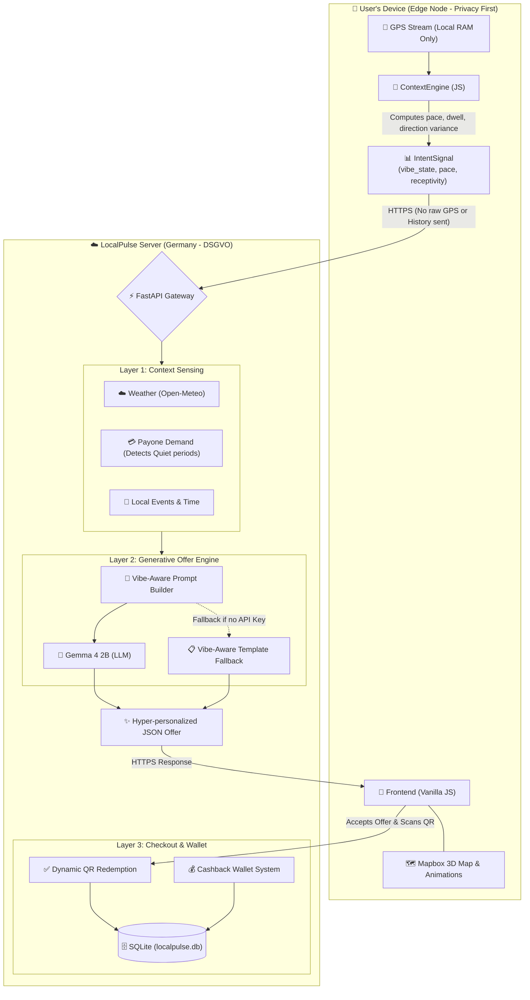
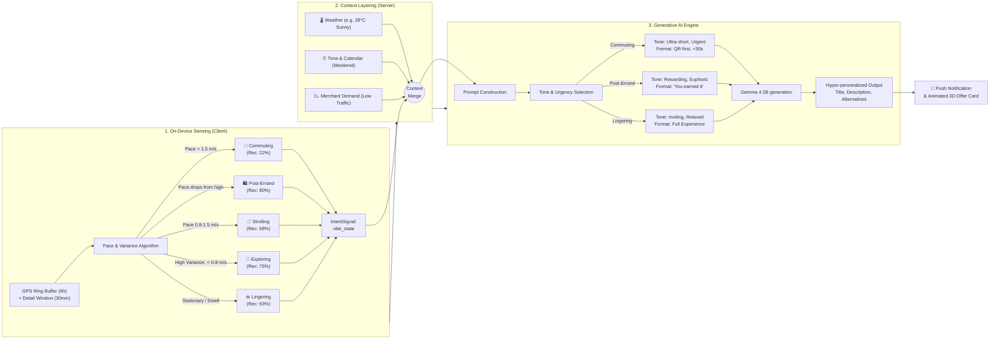

# LocalPulse System Architecture

## 1. Creativity of the Model Architecture
The LocalPulse architecture is designed with **Privacy by Design** at its core. Instead of sending raw GPS data to the server, the user's device acts as an intelligent edge node. The client-side `ContextEngine` processes movement patterns and only sends abstract behavioral signals (like `vibe_state` and `pace_class`) to the backend. The backend then layers this with external context (weather, real-time merchant demand, and events) to construct a vibe-aware prompt for the Generative AI. 

## 2. Hyperpersonalization Flow
The true magic of LocalPulse lies in its hyperpersonalization. It doesn't just offer generic discounts; it dynamically adjusts the **tone, urgency, and length** of the offer based on the user's inferred state of mind (`vibe_state`). A user in a rush gets a short, punchy copy emphasizing speed, while a lingering user gets an invitation to relax.

